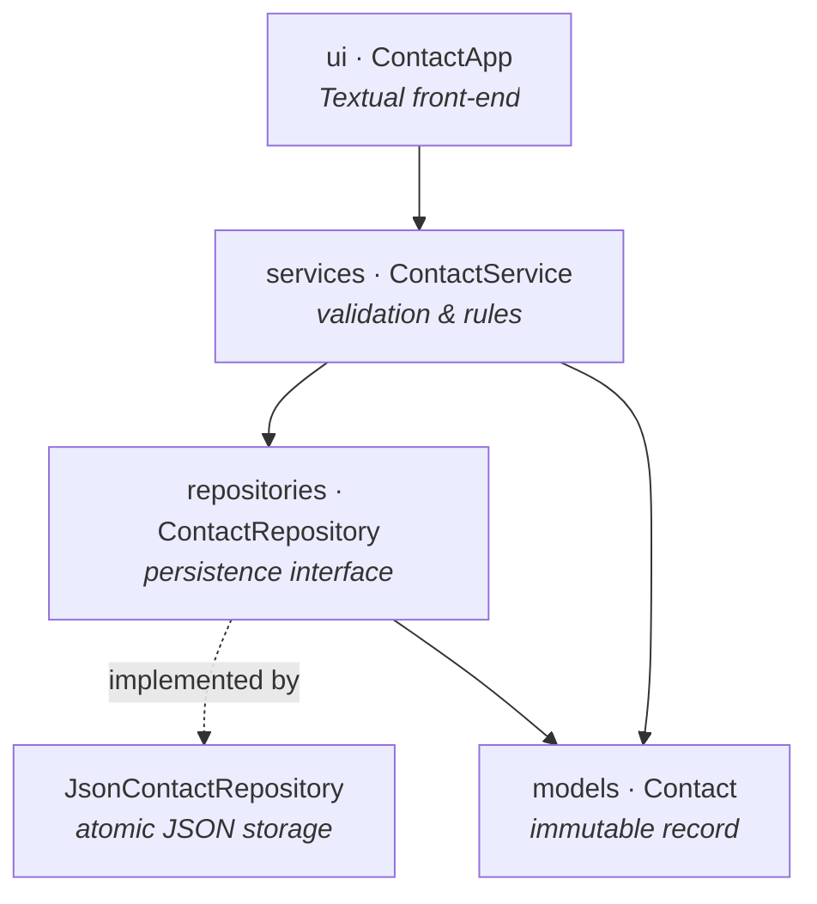

<div align="center">

# Contact Manager

**A fast, keyboard-driven contact manager for your terminal.**

Built in Python with [Textual](https://textual.textualize.io/), wrapped in a retro Rosé Pine Moon theme.

[](https://www.python.org/)
[](https://textual.textualize.io/)
[](LICENSE)
[](tests/)
[](https://docs.astral.sh/ruff/)

</div>

---

## Overview

Contact Manager is a small but complete TUI (terminal user interface) application
for keeping track of names, phone numbers and e-mail addresses — entirely from the
keyboard. It is also a deliberately clean reference for **layered application design
in Python**: the user interface, business rules and storage are fully decoupled, so
each can be understood, tested or replaced on its own.

> [!NOTE]
> The UI never touches the database and the database never knows about the UI.
> Everything flows through a single service layer, which is the only place that
> validates input and enforces the rules.

## Features

| Feature | Description |
| --- | --- |
| 📇 **Browse** | View all contacts in a scrollable, zebra-striped table. |
| ➕ **Add** | Enter a name, number and e-mail inline, then press **Add** or `Enter`. |
| 🗑️ **Delete** | Remove the selected contact with a single `d` keystroke. |
| ⌨️ **Keyboard-first** | Navigate, add and delete without ever reaching for the mouse. |
| ✅ **Validated input** | Names and numbers are required; e-mail format is checked. |
| 💾 **Safe persistence** | Changes are written atomically to JSON — no half-saved files. |
| 🎨 **Themed** | Retro-console styling using the Rosé Pine Moon palette. |

## Screenshots

<div align="center">


</div>

## Installation

> Requires **Python 3.10+**. Textual is installed automatically as a dependency.

```bash
git clone https://github.com/timur-manjosov/contact-manager.git
cd contact-manager

python -m venv .venv
source .venv/bin/activate      # Windows: .venv\Scripts\activate

pip install -e .
```

## Usage

Launch the app with the installed console script:

```bash
contacts
```

…or run it as a module without installing the script:

```bash
python -m contact_manager
```

To add a contact, fill in the **Name**, **Number** and **Email** fields at the
bottom of the screen and press **Add** (or `Enter`). Contacts are saved to
`contacts.json` in the current working directory.

> [!TIP]
> Point the app at a different data file with the `CONTACTS_FILE` environment
> variable: `CONTACTS_FILE=~/.local/share/contacts.json contacts`

### Keybindings

| Key | Action |
| --- | --- |
| `↑` / `↓` | Move between contacts |
| `Enter` | Add the contact in the input fields |
| `d` | Delete the selected contact |
| `q` | Quit |

## Architecture

The codebase follows a layered architecture. Dependencies point **inward** —
outer layers know about inner ones, never the reverse — so business logic has
no idea a terminal UI or a JSON file exists.



| Layer | Responsibility | Knows about |
| --- | --- | --- |
| `models` | Immutable domain data (`Contact`). | nothing |
| `repositories` | Load/save behind an interface; swap JSON for SQLite later. | `models` |
| `services` | Validation, uniqueness, orchestration — the single source of rules. | `models`, `repositories` |
| `ui` | Render widgets, capture input, show notifications. | `services`, `models` |
| `config` | Resolve runtime settings (data-file location). | — |
| `app.py` | Composition root: wires the layers together. | everything |

See [`docs/architecture.md`](docs/architecture.md) for a deeper walkthrough.

## Project structure

```
contact-manager/
├── src/
│   └── contact_manager/
│       ├── app.py              # Composition root + console entry point
│       ├── __main__.py         # `python -m contact_manager`
│       ├── exceptions.py       # Domain exception hierarchy
│       ├── models/             # Contact dataclass
│       ├── repositories/       # ContactRepository + JSON implementation
│       ├── services/           # ContactService (business logic)
│       ├── ui/                 # Textual app + styles.tcss
│       ├── config/             # Settings resolution
│       └── utils/              # Field validators
├── tests/                      # pytest suite (unit + UI integration)
├── docs/                       # Architecture notes
├── assets/                     # Screenshots and media
├── pyproject.toml              # Packaging, deps, tooling config
└── README.md
```

## Development setup

```bash
# Install the package with its development extras (pytest, ruff, …)
pip install -e ".[dev]"
```

| Task | Command |
| --- | --- |
| Run the app | `contacts` |
| Run the tests | `pytest` |
| Lint | `ruff check .` |
| Auto-fix lint | `ruff check --fix .` |

## Testing

The suite covers each layer independently plus an end-to-end UI test driven by
Textual's [pilot](https://textual.textualize.io/guide/testing/) harness:

```bash
pytest            # run everything
pytest -v         # verbose
pytest tests/test_contact_service.py   # one module
```

- **Unit tests** validate the model, validators, repository and service in isolation.
- **Integration tests** drive the real UI with simulated key presses and clicks,
  asserting on application state rather than pixels.

## Roadmap

- [ ] Edit / rename existing contacts (currently delete-and-re-add).
- [ ] Live search & filtering across the table.
- [ ] Pluggable SQLite backend behind the existing repository interface.
- [ ] Import / export (CSV, vCard).
- [ ] Per-contact detail view with notes and tags.
- [ ] Configurable themes.

## Contributing

Contributions are welcome! Please read [`CONTRIBUTING.md`](CONTRIBUTING.md) for the
workflow, coding standards and how to run the checks before opening a pull request.

In short: fork, branch, keep the layers separated, add tests, run `ruff` and
`pytest`, then open a PR.

## License

Distributed under the **MIT License**. See [`LICENSE`](LICENSE) for details.

## Built with

- [Python](https://www.python.org/) 3.10+
- [Textual](https://textual.textualize.io/) — the terminal UI framework
- [pytest](https://docs.pytest.org/) — testing
- [Ruff](https://docs.astral.sh/ruff/) — linting & import sorting
