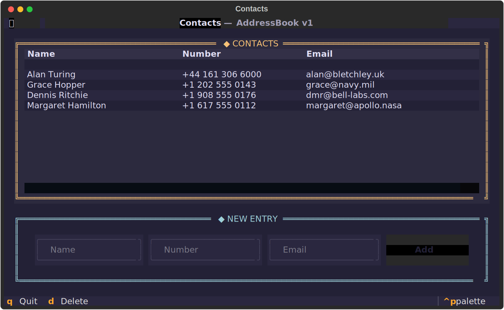

# contact-manager

A keyboard-driven contact manager that runs in your terminal, built in Python with [Textual](https://textual.textualize.io/).



## Features

- View all contacts in a scrollable table
- Add a contact through inline input fields and an **Add** button
- Delete the selected contact with a single keystroke
- Navigate entirely from the keyboard — arrow keys to move, `q` to quit
- Contacts persist between sessions in a JSON file, loaded automatically on startup
- Every change is written to disk immediately
- Retro-console styling with a Rosé Pine Moon theme

## Project structure

The codebase keeps logic and presentation separate. The data layer knows nothing about the interface — its methods take parameters and return data — so it can be tested or reused independently of the TUI.

```
contact-manager/
├── address_book.py   # Data layer: Contact and AddressBook classes (no UI)
├── app.py            # Textual TUI — the only frontend
├── app.tcss          # Styling (Rosé Pine Moon, retro-console theme)
└── pyproject.toml    # Packaging and the `contacts` entry point
```

## Installation

Requires Python 3.9 or newer. Textual is pulled in automatically as a dependency.

```bash
git clone https://github.com/timur-manjosov/contact-manager.git
cd contact-manager
python -m venv .venv
source .venv/bin/activate
pip install -e .
```

## Usage

Once installed, launch the app with:

```bash
contacts
```

To add a contact, fill in the **Name**, **Number**, and **Email** fields at the bottom of the screen and press **Add**. Contacts are saved to `contacts.json` in the working directory.

### Keybindings

| Key          | Action                        |
| ------------ | ----------------------------- |
| `↑` / `↓`    | Move between contacts         |
| `d`          | Delete the selected contact   |
| `q`          | Quit                          |

## Built with

- [Python](https://www.python.org/) 3.9+
- [Textual](https://textual.textualize.io/) — the terminal UI framework
